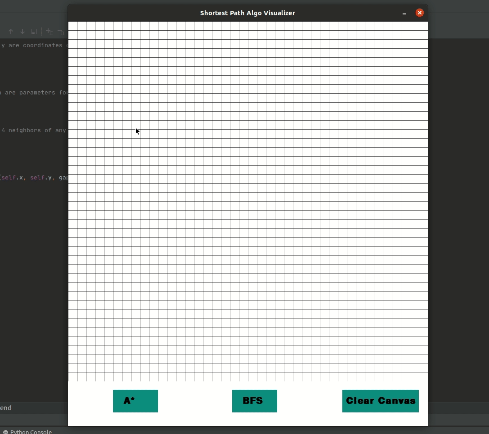

# AStar-BFS-Visiualizer 
 
Visualiztion of Shortest distance between 2 points using A* Algorithm and BFS (Dijkstra’s) Algorithm. Build using python.    
Use left click to build start, end point and walls and right click to erase them.  
Choose the algorithm from the buttons below and it will demostrate the shortest path between the points avoiding the walls.  
I implemented this in python and used pygame to create GUI.  
Make sure to install pygame first.  
